<div align="center">
  <a href="https://taterassistant.com">
    
  </a>
</div>
<h3 align="center">
  <a href="https://taterassistant.com">taterassistant.com</a>
</h3>

**Tater** is a local AI assistant that runs on local LLMs, with **Hydra** handling reasoning, orchestration, and tool use. It includes a built-in voice system that talks directly to ESPHome devices like **VoicePE** and **Sat1**, a WebUI for setup, configuration, and private chats, and integrations across **Discord**, **Home Assistant**, **HomeKit**, **IRC**, **macOS**, **Matrix**, **Telegram**, and even the **OG Xbox via XBMC4Xbox**.

---

## 🧩 Tater Architecture

Tater is built around a modular system:

- **Cores** → core systems that extend Tater's capabilities
- **Portals** → integrations with platforms like Discord, Home Assistant, and more
- **Verbas** → AI-driven tools and actions Tater can perform
- **Integrations** → modular provider packages for devices, services, search providers, and external APIs

These catalogs, versions, metadata, and update paths are managed through **Tater Shop**:

👉 **https://github.com/TaterTotterson/Tater_Shop**

Integration packages are maintained here:

👉 **[TaterTotterson/Tater_Integrations](https://github.com/TaterTotterson/Tater_Integrations)**

---

## Supporting Apps

Some Portals are paired with companion repos/apps that complete the end-user integration:

<p align="center">
  <a href="https://github.com/TaterTotterson/hassio-addons-tater">
    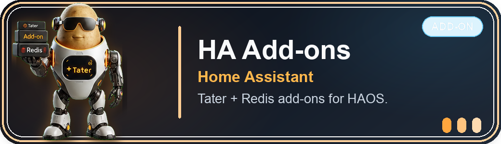
  </a>
  <br>
  <strong>Purpose:</strong> Home Assistant add-on repository for running Tater + Redis Stack directly inside HAOS/Supervised setups.
</p>

<p align="center">
  <a href="https://taterassistant.com/portals/homekit.html">
    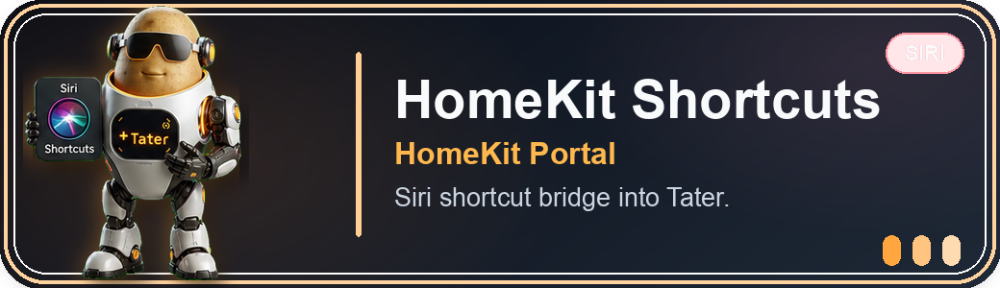
  </a>
  <br>
  <strong>Purpose:</strong> Shortcut guide for Siri -> HomeKit bridge -> Tater workflows.
</p>

<p align="center">
  <a href="https://github.com/TaterTotterson/tater_meshtastic_bridge">
    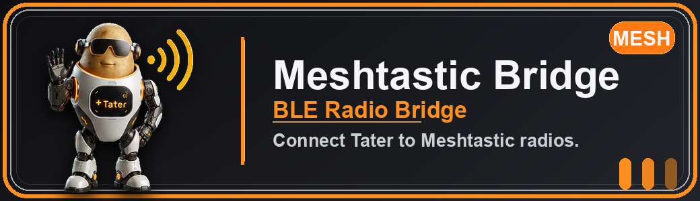
  </a>
  <br>
  <strong>Purpose:</strong> Host-side BLE bridge service for connecting Tater to Meshtastic radios over a simple local API.
</p>

<p align="center">
  <a href="https://github.com/TaterTotterson/microWakeWords">
    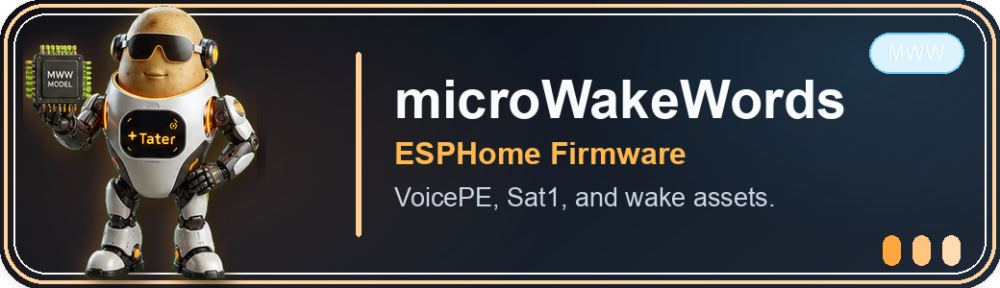
  </a>
  <br>
  <strong>Purpose:</strong> Tater VoicePE, Satellite1, and related ESPHome firmware plus microWakeWord model assets.
</p>

<p align="center">
  <a href="https://github.com/TaterTotterson/microWakeWord-Trainer-AppleSilicon">
    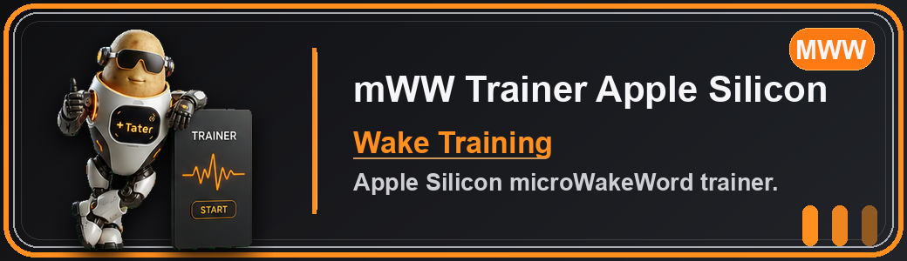
  </a>
  <br>
  <strong>Purpose:</strong> Apple Silicon trainer for creating custom microWakeWord models.
</p>

<p align="center">
  <a href="https://github.com/TaterTotterson/microWakeWord-Trainer-Nvidia-Docker">
    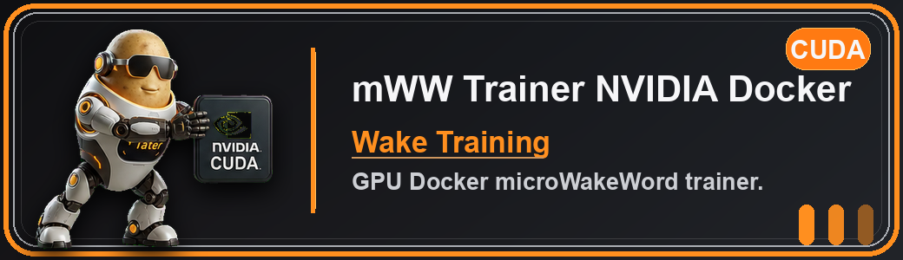
  </a>
  <br>
  <strong>Purpose:</strong> NVIDIA Docker trainer for creating custom microWakeWord models with GPU acceleration.
</p>

<p align="center">
  <a href="https://github.com/TaterTotterson/nanoWakeWord-Trainer">
    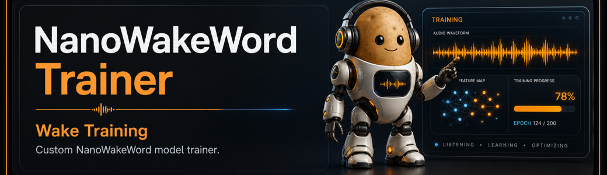
  </a>
  <br>
  <strong>Purpose:</strong> Trainer for custom NanoWakeWord models used by Tater's local or standalone NanoWakeWord server.
</p>

<p align="center">
  <a href="https://github.com/TaterTotterson/openWakeWord-Trainer">
    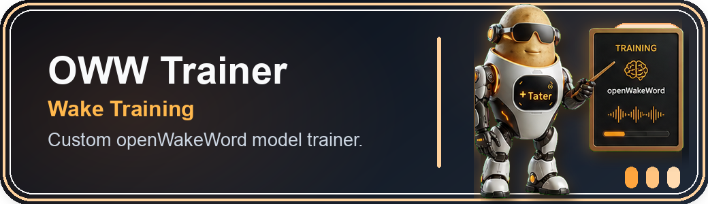
  </a>
  <br>
  <strong>Purpose:</strong> Trainer for custom openWakeWord models used by Tater's local or standalone openWakeWord server.
</p>

<p align="center">
  <a href="https://github.com/TaterTotterson/Tater-MacOS">
    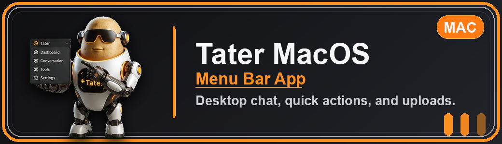
  </a>
  <br>
  <strong>Purpose:</strong> Menu bar companion app and bridge client for desktop chat, quick actions, and uploads.
</p>

<p align="center">
  <a href="https://github.com/TaterTotterson/Tater-NWW-Server">
    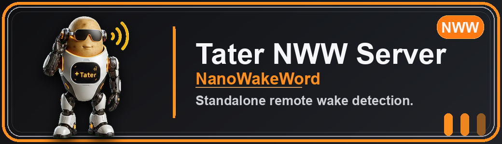
  </a>
  <br>
  <strong>Purpose:</strong> Standalone NanoWakeWord WebSocket server for Tater satellites using remote NanoWakeWord wake detection.
</p>

<p align="center">
  <a href="https://github.com/TaterTotterson/Tater-OWW-Server">
    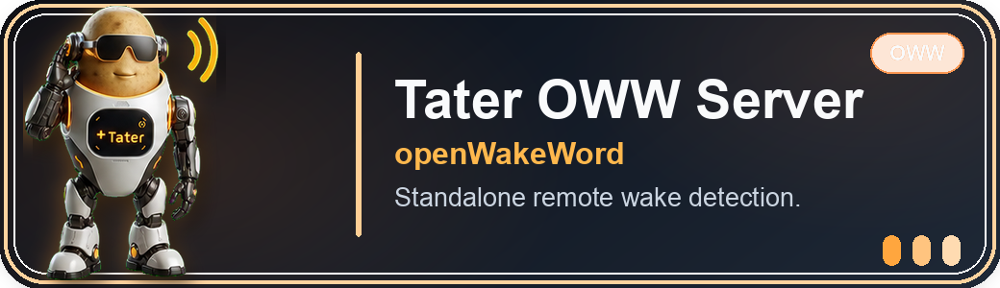
  </a>
  <br>
  <strong>Purpose:</strong> Standalone openWakeWord WebSocket server for Tater satellites that need remote wake detection outside the main Tater app.
</p>

<p align="center">
  <a href="https://github.com/TaterTotterson/Tater-S3Box-Display">
    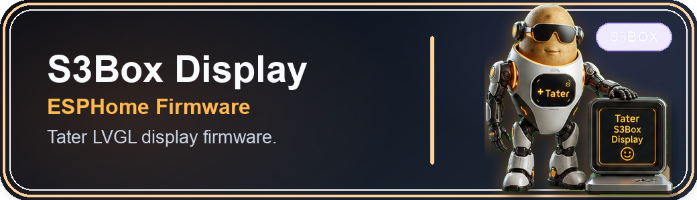
  </a>
  <br>
  <strong>Purpose:</strong> ESP32-S3-BOX display firmware for Tater voice and dashboard-style device experiences.
</p>

<p align="center">
  <a href="https://github.com/TaterTotterson/skin.cortana.tater-xbmc">
    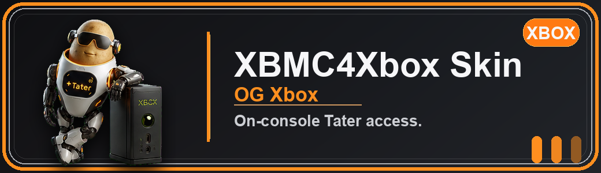
  </a>
  <br>
  <strong>Purpose:</strong> OG Xbox/XBMC4Xbox skin and script integration for on-console Tater access.
</p>

---

# Installation
> **Note**:
> - Tater currently recommends using gemma-4-26b-a4b (disable thinking), qwen/qwen3.5-35b-a3b (disable thinking), qwen3-coder-next, qwen3-next-80b, or gpt-oss-120b (disable thinking)

## Local Installation

### Prerequisites
- Python 3.11
- **[Redis-Stack](https://hub.docker.com/r/redis/redis-stack)**
- A local LLM runtime (such as **Ollama**, **LocalAI**, **LM Studio**, or **Lemonade**)
- Docker is optional, but it is the easiest way to run Redis Stack on machines that do not package it natively.

### Install Redis Stack (Required)

Redis is required for Tater memory, settings, Verbas, automations, and runtime state.

#### Option 1: Docker

```bash
docker run -d --name tater_redis \
  -p 6379:6379 \
  redis/redis-stack-server:latest
```

#### Option 2: Ubuntu/Debian with APT

```bash
sudo apt-get install -y lsb-release curl gpg
curl -fsSL https://packages.redis.io/gpg | sudo gpg --dearmor -o /usr/share/keyrings/redis-archive-keyring.gpg
sudo chmod 644 /usr/share/keyrings/redis-archive-keyring.gpg
echo "deb [signed-by=/usr/share/keyrings/redis-archive-keyring.gpg] https://packages.redis.io/deb $(lsb_release -cs) main" | sudo tee /etc/apt/sources.list.d/redis.list
sudo apt-get update
sudo apt-get install -y redis-stack-server
sudo systemctl enable redis-stack-server
sudo systemctl start redis-stack-server
```

Verify Redis is up:

```bash
redis-cli ping
```

Expected output:

```text
PONG
```

### Set Up Tater

1. **Clone the Repository**

```bash
git clone https://github.com/TaterTotterson/Tater.git
```

2. **Navigate to the Project Directory**

```bash
cd Tater
```

3. **Run Tater Setup**

Use the interactive setup menu to choose the right local runtime profile:

```bash
sh setup_tater.sh
```

The setup menu creates `.venv`, installs Tater's Python dependencies, and writes the selected runtime profile to `.runtime/tater_profile.env`.

Available local profiles:
- **CPU**: safe default for most local Linux installs and generic ARM hosts.
- **macOS Apple Silicon**: native Mac setup with Apple Metal/MPS for PyTorch-backed SpeechBrain and Kokoro when available, plus MLX Whisper for local STT.
- **NVIDIA desktop/server**: native amd64 CUDA setup for RTX/GTX machines.
- **AMD ROCm / Strix Halo**: native Linux setup for ROCm-capable Radeon and Ryzen AI Max / Strix Halo systems.
- **Jetson**: native ARM64 setup that uses JetPack/system AI packages and CUDA when compatible Python runtimes are installed.
- **Jetson Thor**: native ARM64 setup for Thor / JetPack 7 systems and CUDA 13-compatible JetPack runtimes.

Non-interactive setup is also available:

```bash
sh setup_tater.sh cpu
sh setup_tater.sh macos
sh setup_tater.sh nvidia
sh setup_tater.sh rocm
sh setup_tater.sh jetson
sh setup_tater.sh thor
```

### Local Voice Acceleration Notes

The setup profile only prepares the runtime. Actual voice model choices are managed in TaterOS under **Settings -> Models** and **Settings -> ESPHome -> Voice Pipeline**.

macOS Apple Silicon:
- The macOS profile writes `PYTORCH_ENABLE_MPS_FALLBACK=1` so PyTorch can fall back to CPU for unsupported MPS operations.
- It attempts to install `mlx-whisper` and the official PyTorch `kokoro` package.
- Select **Settings -> Models -> STT Backend -> MLX Whisper** for Apple-native Whisper STT.
- MLX Whisper defaults to `mlx-community/whisper-base.en-mlx`; set `TATER_MLX_WHISPER_MODEL` to use another MLX Whisper model.
- Kokoro automatically uses the PyTorch engine on Apple Metal/MPS when available. Set `TATER_KOKORO_ENGINE=onnx` to force the existing ONNX path or `TATER_KOKORO_ENGINE=torch` to force PyTorch.

If native macOS dependency builds fail, install these Homebrew packages and rerun setup:

```bash
brew install ffmpeg libolm pkg-config
```

NVIDIA desktop/server:
- The `nvidia` profile installs CUDA PyTorch wheels, CUDA/cuDNN runtime packages, and the GPU ONNX Runtime build.
- In TaterOS, use **Settings -> Models -> Voice Acceleration** to select Auto, CPU, NVIDIA CUDA, AMD ROCm, or Apple Metal/MPS where supported.
- Faster Whisper compute type defaults to Auto. Auto uses `float16` on newer CUDA GPUs and switches to `int8` on older CUDA cards such as Pascal / GTX 10-series, where `float16` can fail.
- To override Faster Whisper compute type, use **Settings -> ESPHome -> Voice Pipeline -> Speech Recognition -> Faster Whisper Compute Type** or set `TATER_FASTER_WHISPER_COMPUTE_TYPE` to `auto`, `int8`, `float32`, `float16`, `int8_float32`, or `int8_float16`.
- To restrict which GPUs native Tater can see, start it with `CUDA_VISIBLE_DEVICES=0 sh run_ui.sh` or use a GPU UUID.

AMD ROCm / Strix Halo:
- The `rocm` profile installs PyTorch from the ROCm wheel index, then installs Tater dependencies and the official PyTorch Kokoro package.
- AMD ROCm support is Linux-only and depends on the ROCm runtime installed for the GPU/APU.
- Tater uses ROCm for PyTorch-backed models such as Kokoro Torch and SpeechBrain Speaker ID / Emotion ID. PyTorch ROCm exposes devices through the `cuda` API internally, but Tater labels it separately as AMD ROCm in settings and logs.
- Faster Whisper still falls back to CPU unless its CTranslate2 backend reports CUDA support; ROCm acceleration is not assumed for Faster Whisper.
- Strix Halo may require newer AMD ROCm wheels than the default PyTorch index. Override the PyTorch ROCm wheel source with `TATER_ROCM_PYTORCH_INDEX_URL` before running setup if needed.

Jetson and Thor:
- The `jetson` and `thor` profiles create a venv with `--system-site-packages` so NVIDIA JetPack-provided Python AI packages can be reused.
- Setup intentionally avoids replacing JetPack PyTorch with generic pip wheels.
- CUDA support depends on the JetPack / Thor runtime installed on the device.

General voice notes:
- Tater warms selected local STT/TTS models at startup and after saving voice model settings. Set `TATER_SPEECH_WARMUP_ON_STARTUP=false` to disable startup warmup.
- Kokoro output is boosted slightly by default for clearer satellite playback. Tune it with `TATER_KOKORO_OUTPUT_GAIN`; the default is `1.5`.
- Voice activity detection defaults to Silero VAD. Low-power hosts can switch the Voice Pipeline VAD backend to WebRTC, which uses `webrtcvad-wheels`.
- If Speaker ID or Emotion ID is enabled, SpeechBrain can use CUDA or MPS when supported, with CPU fallback.

### Run the Web UI

Start the TaterOS backend/frontend:

```bash
sh run_ui.sh
```

If `.venv` exists, `run_ui.sh` uses it automatically. It also loads `.runtime/tater_profile.env` when present.

The launcher listens on `0.0.0.0:8501` by default. To change it, set `HTMLUI_PORT`:

```bash
HTMLUI_PORT=8601 sh run_ui.sh
```

Then open:

```text
http://127.0.0.1:8501
```

Once the WebUI is up, continue to **Post-Install Setup** below.

## Docker Installation

### 1. Pull the Image

Pull the prebuilt image with the following command:

```bash
docker pull ghcr.io/tatertotterson/tater:latest
```

### 2. Run Container

Redis settings are configured in the WebUI setup popup (not via `.env`).

Recommended Docker networking:
- Use `--network host` so Tater shares the host network directly.
- This avoids managing a growing list of `-p` mappings for WebUI, voice, and other runtime surfaces.
- With host networking, Tater listens on the host directly, so you do not need to publish Tater ports manually.
- To change the WebUI port, set `HTMLUI_PORT`, for example `-e HTMLUI_PORT=8601`.
- If you are not using host networking, publish the same container port, for example `-p 8601:8601`.

Important for Docker persistence:
- Add a path mapping for `/app/agent_lab` (container) -> `/mnt/user/appdata/tater/agent_lab` (host example).
- Without this mapping, data in `/agent_lab` (logs/downloads/documents/workspace) can be lost on container rebuilds/updates.
- Add a path mapping for `/app/.runtime` (container) -> `/mnt/user/appdata/tater/runtime` (host example).
- Without this mapping, Redis setup popup settings can be lost on container rebuilds/updates.

---

Example: Docker setup
```
docker run -d --name tater_webui \
  --network host \
  -e TZ=America/Chicago \
  -e HTMLUI_PORT=8501 \
  -v /etc/localtime:/etc/localtime:ro \
  -v /etc/timezone:/etc/timezone:ro \
  -v /agent_lab:/app/agent_lab \
  -v /tater_runtime:/app/.runtime \
  ghcr.io/tatertotterson/tater:latest
```

### NVIDIA Docker

The NVIDIA image is amd64-only. Use the default `latest` image for CPU-first installs and ARM hosts.
The NVIDIA image uses CUDA 12.8 PyTorch wheels plus CUDA/cuDNN runtime packages for RTX 30, 40, and 50 series cards. Voice model tuning, Faster Whisper compute type, warmup, VAD, and SpeechBrain acceleration use the same TaterOS settings described in **Local Voice Acceleration Notes**.

Host requirements:
- Install the NVIDIA driver.
- Install NVIDIA Container Toolkit before starting the compose override.

Optional NVIDIA GPU build for Faster Whisper STT plus Kokoro TTS:

```
docker compose -f docker-compose.yml -f docker-compose.nvidia.yml up --build
```

Prebuilt NVIDIA image:
```bash
docker pull ghcr.io/tatertotterson/tater:nvidia
```

To restrict which GPUs Tater can see in the NVIDIA compose setup, set `NVIDIA_VISIBLE_DEVICES` before launching, for example `NVIDIA_VISIBLE_DEVICES=0` or a GPU UUID. Inside the container, CUDA device `0` maps to the first visible GPU.

Build and push the NVIDIA image:

```bash
docker buildx build \
  --platform linux/amd64 \
  -f Dockerfile.nvidia \
  -t ghcr.io/tatertotterson/tater:nvidia \
  --push .
```

### 3. Access the Web UI

Once the container is running with host networking, open your browser and navigate to:

- [http://localhost:8501](http://localhost:8501) from the same machine
- `http://<host-ip>:8501` from another device on your network

If you changed `HTMLUI_PORT`, use that port in the URL.

Once the WebUI is up, continue to **Post-Install Setup** below.

---

## Unraid Installation


Tater is available in the **Unraid Community Apps** store.

You can install both:
- **Tater**
- **Redis Stack**

directly from the Unraid App Store with a one-click template.

Unraid note:
- Add container path mappings for `/app/agent_lab` and `/app/.runtime` to persistent shares, for example `/mnt/user/appdata/tater/agent_lab` and `/mnt/user/appdata/tater/runtime`.
- Also set `TZ` and map `/etc/localtime` plus `/etc/timezone` if you want local time inside the container.

Once the Unraid containers are installed and running, continue to **Post-Install Setup** below.

---

## Home Assistant Installation

A dedicated Home Assistant add-on repository is available here:

https://github.com/TaterTotterson/hassio-addons-tater

Click the button below to add the repository to Home Assistant:

[](
https://my.home-assistant.io/redirect/supervisor_add_addon_repository/?repository_url=https://github.com/TaterTotterson/hassio-addons-tater
)

Once added, the following add-ons will appear in the Home Assistant Add-on Store:

- **Redis Stack**: required for Tater memory, Verbas, and automations
- **Tater AI Assistant**: the main Tater service

Install order:

1. Install and start Redis Stack.
2. Install Tater AI Assistant.
3. Configure your LLM and Redis settings in the Tater add-on.
4. Start Tater.

Once the add-ons are running, continue to **Post-Install Setup** below.

---

## Post-Install Setup

After Tater is running, open TaterOS and finish the first-run setup:

1. Complete the **Redis Setup** popup if Tater shows it:
   - Redis host
   - Redis port
   - optional auth (`username` / `password`)
   - optional TLS settings
2. Configure your model endpoint in **Settings**:
   - `Hydra LLM Host`
   - `Hydra LLM Port`
   - `Hydra LLM Model`
3. Optional:
   - add more Base servers for round-robin regular AI calls
   - enable `Beast Mode` and set per-head model settings for Chat/Astraeus/Thanatos/Minos/Hermes

Redis connection settings are saved locally by TaterOS for future boots.
Hydra model settings are stored in Redis and used at runtime.

Docker note:
- Redis setup popup config is stored at `/app/.runtime/redis_connection.json` inside the container.
- If you want a custom config file location, set `TATER_REDIS_CONFIG_PATH` and mount that target path from the host.

Access-log note:
- `run_ui.sh` starts Uvicorn with `--no-access-log` to suppress per-request lines.


https://github.com/user-attachments/assets/9138f485-ccd6-46e0-9295-f5617c079fea
