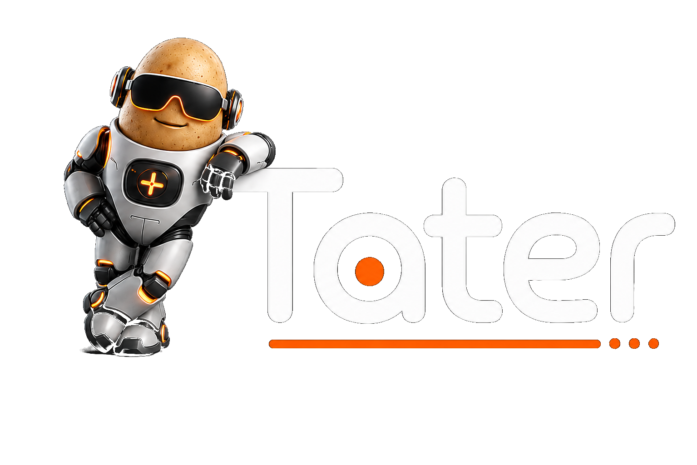

<div align="center">
  <a href="https://taterassistant.com">
    
  </a>
</div>
<h3 align="center">
  <a href="https://taterassistant.com">taterassistant.com</a>
</h3>

**Tater** is a local-first AI platform that can run local models through **llama.cpp**, **Hugging Face Transformers**, and **MLX**, or connect to OpenAI-compatible APIs. It supports voice satellites like **VoicePE**, **Sat1**, **S3Box**, and **ReSpeaker XVF3800**, plus portals for **Discord**, **Home Assistant**, **HomeKit**, **IRC**, **macOS**, **Matrix**, **Meshtastic**, **Telegram**, and **XBMC4Xbox**.

---

## What's Changed In v94

- Added first-class **Tater Native Firmware** support for official voice satellites, including USB flashing, OTA update checks, pairing, diagnostics, per-satellite settings, timers, intercom, broadcast playback, LED controls, and S3 Box display settings.
- Added the **Add Satellite** pairing flow in TaterOS. Tater now creates pairing codes that new native satellites use during Wi-Fi setup.
- Added native satellite support for VoicePE, Sat1, ESP32-S3-BOX display satellites, and ReSpeaker XVF3800 devices.
- Moved satellite configuration into TaterOS instead of ESPHome-style live entities, with settings stored per satellite.
- Improved streaming playback, wake/reopen behavior, native timer alerts, reply routing, and firmware update handling for Tater Native satellites.

### Native Satellite Upgrade Note

Existing satellites that are still running the older ESPHome-based firmware must be moved to **Tater Native Firmware** before they can use the new native satellite features.

First-time native setup:

1. Open **TaterOS -> Satellites** and choose **Add Satellite**. Leave the pairing code popup open.
2. Connect the satellite to your Mac with USB.
3. Use the Tater firmware flasher to install the correct **factory** image for that device model. Factory flashing is required the first time a satellite moves to native firmware.
4. After flashing, the satellite starts a setup hotspot named like `Tater-Setup-AB12`.
5. Join that Wi-Fi network from a phone or computer, then open `http://192.168.4.1` if the setup page does not open automatically.
6. Enter your Wi-Fi network, Tater server address, device name, room, and the pairing code shown in TaterOS.
7. Save the setup. The satellite will reboot, join your Wi-Fi, pair with Tater, and appear on the Satellites page.

After a satellite is paired with native firmware, future firmware updates can be managed from TaterOS with OTA updates. USB flashing remains available for recovery or when moving a device from older firmware to Tater Native Firmware.

---

## Little Spud Companion App

Little Spud connects to your Tater Spud Hub for chat, TTS, STT, and notifications from your Apple devices.

<p>
  <a href="https://apps.apple.com/app/little-spud/id6781400718">
    
  </a>
</p>

---

## 🧩 Tater Architecture

Tater is built around a modular system:

- **Cores** → core systems that extend Tater's capabilities
- **Portals** → integrations with platforms like Discord, Home Assistant, and more
- **Verbas** → AI-driven tools and actions Tater can perform
- **Integrations** → modular provider packages for devices, services, search providers, and external APIs

These catalogs, versions, metadata, and update paths are managed through **Tater Shop**:

👉 **https://github.com/TaterTotterson/Tater_Shop**

Integration packages are maintained here:

👉 **[TaterTotterson/Tater_Integrations](https://github.com/TaterTotterson/Tater_Integrations)**

---

## Supporting Apps

Some Portals are paired with companion repos/apps that complete the end-user integration:

| App / Repo | Purpose |
| --- | --- |
| [HA Add-ons](https://github.com/TaterTotterson/hassio-addons-tater) | Home Assistant add-on repository for running Tater directly inside HAOS/Supervised setups. |
| [HomeKit Shortcuts](https://taterassistant.com/portals/homekit.html) | Shortcut guide for Siri -> HomeKit bridge -> Tater workflows. |
| [Meshtastic Bridge](https://github.com/TaterTotterson/tater_meshtastic_bridge) | Host-side BLE bridge service for connecting Tater to Meshtastic radios over a simple local API. |
| [Tater Native Firmware](https://github.com/TaterTotterson/Tater-Native-Firmware) | Native firmware for Tater voice satellites and related hardware. |
| [Little Spud WebUI](https://github.com/TaterTotterson/Little-Spud-WebUI) | Lightweight browser client for chatting with a paired Tater Spud Hub, including media, TTS/STT, and local device notifications. |
| [Little Spud App](https://github.com/TaterTotterson/Little-Spud-App) | Native Little Spud companion app for connecting Apple devices to a paired Tater Spud Hub. |
| [Reachy Mini Voice Satellite](https://huggingface.co/spaces/TaterTotterson/tater_voice_sat) | Reachy Mini robot app that turns Reachy Mini into a voice satellite for Tater or Home Assistant. |
| [Reachy Mini Tater Standalone](https://huggingface.co/spaces/TaterTotterson/tater_reachy_standalone) | Reachy Mini robot app that can run the full Tater app/stack directly on Reachy. |
| [XBMC4Xbox Skin](https://github.com/TaterTotterson/skin.cortana.tater-xbmc) | OG Xbox/XBMC4Xbox skin and script integration for on-console Tater access. |

---

# Installation
> **Note**:
> - Tater can run any compatible local or OpenAI-compatible model. If you use a thinking model, disable thinking for best Hydra/tool behavior. Tater's built-in local providers try to suppress thinking automatically where supported.

## macOS App Installation

<p>
  <a href="https://taterassistant.com">
    
  </a>
</p>

1. **Download the latest macOS installer**

   [Download the latest Tater for macOS](https://taterassistant.com)

2. **Install Tater**

   Open the DMG, then drag **Tater.app** into **Applications**.

3. **Launch Tater**

   Open **Tater** from Applications. On first launch, the app prepares its private runtime under:

   ```text
   ~/.taterassistant/
   ```

   The app stores its managed Python runtime, virtual environment, runtime settings, logs, updates, and `agent_lab` data there. It does not use this source checkout's `.venv`, `.runtime`, or `agent_lab` folders.

4. **Finish setup in TaterOS**

   The app starts Tater on `127.0.0.1:8501` and opens the WebUI in the native window. If Python 3.11 is not already available, the launcher downloads a standalone CPython 3.11 runtime into `~/.taterassistant/python/` and uses it to build the private venv.

Closing the window keeps Tater running in the menu bar. Use the menu bar item to reopen Tater, open it in a browser, stop, restart, show logs, check for updates, install available updates, or quit.

Once the WebUI is up, continue to **Post-Install Setup** below.

## Unraid Installation


Tater is available in the **Unraid Community Apps** store.

You can install **Tater** directly from the Unraid App Store with a one-click template.

Unraid note:
- Add container path mappings for `/app/agent_lab` and `/app/.runtime` to persistent shares, for example `/mnt/user/appdata/tater/agent_lab` and `/mnt/user/appdata/tater/runtime`.
- Also set `TZ` and map `/etc/localtime` plus `/etc/timezone` if you want local time inside the container.

Once the Unraid containers are installed and running, continue to **Post-Install Setup** below.

## Home Assistant Installation

A dedicated Home Assistant add-on repository is available here:

https://github.com/TaterTotterson/hassio-addons-tater

Click the button below to add the repository to Home Assistant:

[](
https://my.home-assistant.io/redirect/supervisor_add_addon_repository/?repository_url=https://github.com/TaterTotterson/hassio-addons-tater
)

Once added, the **Tater AI Assistant** add-on will appear in the Home Assistant Add-on Store.

Install order:

1. Install Tater AI Assistant.
2. Configure your LLM settings in the Tater add-on.
3. Start Tater.

Once the add-ons are running, continue to **Post-Install Setup** below.

## Reachy Mini Installation

<p>
  <a href="https://huggingface.co/spaces/TaterTotterson/tater_reachy_standalone">
    
  </a>
</p>

The **Reachy Mini Tater Standalone** app is the easy Reachy Mini install path. It runs the Tater app/stack directly on Reachy Mini and should appear from Reachy's app list when available.

Install path:

1. Open [Reachy Mini Tater Standalone](https://huggingface.co/spaces/TaterTotterson/tater_reachy_standalone).
2. Follow the Space instructions for installing or launching it on Reachy Mini.
3. Continue to **Post-Install Setup** once Tater is running.

## Local Installation

### Prerequisites
- Python 3.11
- A local OpenAI-compatible LLM runtime (such as **Ollama**, **LocalAI**, **LM Studio**, or **Lemonade**) or Tater's built-in **Hugging Face Transformers**, **llama.cpp GGUF**, or **MLX LM** providers
- Docker is optional.

### Set Up Tater

1. **Clone the Repository**

```bash
git clone https://github.com/TaterTotterson/Tater.git
```

2. **Navigate to the Project Directory**

```bash
cd Tater
```

3. **Run Tater Setup**

Use the interactive setup menu to choose the right local runtime profile:

```bash
sh setup_tater.sh
```

The setup menu creates `.venv`, installs Tater's Python dependencies, and writes the selected runtime profile to `.runtime/tater_profile.env`.

Available local profiles:
- **CPU**: safe default for most local Linux installs and generic ARM hosts.
- **macOS Apple Silicon**: native Mac setup with Apple Metal/MPS for PyTorch-backed SpeechBrain and Kokoro when available, plus MLX Whisper for local STT.
- **NVIDIA desktop/server**: native amd64 CUDA setup for RTX/GTX machines.
- **AMD ROCm / Strix Halo**: native Linux setup for ROCm-capable Radeon and Ryzen AI Max / Strix Halo systems.
- **Jetson**: native ARM64 setup that uses JetPack/system AI packages and CUDA when compatible Python runtimes are installed.
- **Jetson Thor**: native ARM64 setup for Thor / JetPack 7 systems and CUDA 13-compatible JetPack runtimes.

Non-interactive setup is also available:

```bash
sh setup_tater.sh cpu
sh setup_tater.sh macos
sh setup_tater.sh nvidia
sh setup_tater.sh rocm
sh setup_tater.sh jetson
sh setup_tater.sh thor
```

### Local Voice Acceleration Notes

The setup profile only prepares the runtime. Actual voice model choices are managed in TaterOS under **Settings -> Models** and **Settings -> Voice Pipeline**.

macOS Apple Silicon:
- The macOS profile writes `PYTORCH_ENABLE_MPS_FALLBACK=1` so PyTorch can fall back to CPU for unsupported MPS operations.
- It attempts to install `mlx-whisper` and the official PyTorch `kokoro` package.
- It builds Tater's native llama.cpp engine (`llama-server`) with Metal when available; MLX LM remains the preferred Apple-native local LLM provider.
- Select **Settings -> Models -> STT Backend -> MLX Whisper** for Apple-native Whisper STT.
- MLX Whisper defaults to `mlx-community/whisper-base.en-mlx`; set `TATER_MLX_WHISPER_MODEL` to use another MLX Whisper model.
- Kokoro automatically uses the PyTorch engine on Apple Metal/MPS when available. Set `TATER_KOKORO_ENGINE=onnx` to force the existing ONNX path or `TATER_KOKORO_ENGINE=torch` to force PyTorch.

If native macOS dependency builds fail, install these Homebrew packages and rerun setup:

```bash
brew install ffmpeg cmake
```

Matrix encryption and embedded Redis are enabled by default. The macOS Apple Silicon setup includes bundled native wheels for `python-olm` and `redislite` so clean app installs do not need to compile those packages during first launch. Source installs on other macOS architectures may still need native build tools plus `libolm` and `pkg-config`.

NVIDIA desktop/server:
- The `nvidia` profile installs CUDA PyTorch wheels, CUDA/cuDNN runtime packages, GPU ONNX Runtime, and builds Tater's native llama.cpp engine with CUDA.
- To customize the llama.cpp build, set `TATER_LLAMA_CPP_CMAKE_ARGS` before running setup. The NVIDIA profile defaults to `-DGGML_CUDA=on`.
- In TaterOS, use **Settings -> Models -> Voice Acceleration** to select Auto, CPU, NVIDIA CUDA, AMD ROCm, or Apple Metal/MPS where supported.
- Faster Whisper compute type defaults to Auto. Auto uses `float16` on newer CUDA GPUs and switches to `int8` on older CUDA cards such as Pascal / GTX 10-series, where `float16` can fail.
- To override Faster Whisper compute type, use **Settings -> Voice Pipeline -> Speech Recognition -> Faster Whisper Compute Type** or set `TATER_FASTER_WHISPER_COMPUTE_TYPE` to `auto`, `int8`, `float32`, `float16`, `int8_float32`, or `int8_float16`.
- To restrict which GPUs native Tater can see, start it with `CUDA_VISIBLE_DEVICES=0 sh run_ui.sh` or use a GPU UUID.

AMD ROCm / Strix Halo:
- The `rocm` profile installs PyTorch from the ROCm wheel index, then installs Tater dependencies and the official PyTorch Kokoro package.
- Tater keeps the ROCm PyTorch wheel in place when installing dependencies so Hugging Face Transformers can use ROCm through PyTorch when the device is supported.
- AMD ROCm support is Linux-only and depends on the ROCm runtime installed for the GPU/APU.
- Tater uses ROCm for PyTorch-backed models such as Kokoro Torch and SpeechBrain Speaker ID / Emotion ID. PyTorch ROCm exposes devices through the `cuda` API internally, but Tater labels it separately as AMD ROCm in settings and logs.
- llama.cpp ROCm/HIP is built by setup with `-DGGML_HIP=on` by default. Override with `TATER_LLAMA_CPP_CMAKE_ARGS` if your ROCm stack needs a different llama.cpp flag.
- Faster Whisper still falls back to CPU unless its CTranslate2 backend reports CUDA support; ROCm acceleration is not assumed for Faster Whisper.
- Strix Halo may require newer AMD ROCm wheels than the default PyTorch index. Override the PyTorch ROCm wheel source with `TATER_ROCM_PYTORCH_INDEX_URL` before running setup if needed.

Jetson and Thor:
- The `jetson` and `thor` profiles create a venv with `--system-site-packages` so NVIDIA JetPack-provided Python AI packages can be reused.
- Setup intentionally avoids replacing JetPack PyTorch with generic pip wheels.
- Hugging Face Transformers can use JetPack CUDA when the system PyTorch install exposes CUDA. Setup also attempts a native llama.cpp CUDA build for GGUF offload.

General voice notes:
- Tater warms selected local STT/TTS models at startup and after saving voice model settings. Set `TATER_SPEECH_WARMUP_ON_STARTUP=false` to disable startup warmup.
- Kokoro and Pocket TTS output are boosted slightly by default for clearer satellite playback. Tune them in Settings -> Models -> Speech -> TTS, or override local runs with `TATER_KOKORO_OUTPUT_GAIN` / `TATER_POCKET_TTS_OUTPUT_GAIN`; both default to `1.5`.
- Voice activity detection defaults to Silero VAD. Low-power hosts can switch the Voice Pipeline VAD backend to WebRTC, which uses `webrtcvad-wheels`.
- If Speaker ID or Emotion ID is enabled, SpeechBrain can use CUDA or MPS when supported, with CPU fallback.

### Run the Web UI

Start the TaterOS backend/frontend:

```bash
sh run_ui.sh
```

If `.venv` exists, `run_ui.sh` uses it automatically. It also loads `.runtime/tater_profile.env` when present.

The launcher listens on `0.0.0.0:8501` by default. To change it, set `HTMLUI_PORT`:

```bash
HTMLUI_PORT=8601 sh run_ui.sh
```

Then open:

```text
http://127.0.0.1:8501
```

Once the WebUI is up, continue to **Post-Install Setup** below.

## Docker Installation

### 1. Pull the Image

Pull the prebuilt image with the following command:

```bash
docker pull ghcr.io/tatertotterson/tater:latest
```

### 2. Run Container

Recommended Docker networking:
- Use `--network host` so Tater shares the host network directly.
- This avoids managing a growing list of `-p` mappings for WebUI, voice, and other runtime surfaces.
- With host networking, Tater listens on the host directly, so you do not need to publish Tater ports manually.
- To change the WebUI port, set `HTMLUI_PORT`, for example `-e HTMLUI_PORT=8601`.
- If you are not using host networking, publish the same container port, for example `-p 8601:8601`.

Important for Docker persistence:
- Add a path mapping for `/app/agent_lab` (container) -> `/mnt/user/appdata/tater/agent_lab` (host example).
- Without this mapping, data in `/agent_lab` (logs/downloads/documents/workspace) can be lost on container rebuilds/updates.
- Add a path mapping for `/app/.runtime` (container) -> `/mnt/user/appdata/tater/runtime` (host example).
- Without this mapping, local runtime settings can be lost on container rebuilds/updates.

---

Example: Docker setup
```
docker run -d --name tater_webui \
  --network host \
  -e TZ=America/Chicago \
  -e HTMLUI_PORT=8501 \
  -v /etc/localtime:/etc/localtime:ro \
  -v /etc/timezone:/etc/timezone:ro \
  -v /agent_lab:/app/agent_lab \
  -v /tater_runtime:/app/.runtime \
  ghcr.io/tatertotterson/tater:latest
```

### NVIDIA Docker

The NVIDIA image is amd64-only. Use the default `latest` image for CPU-first installs and ARM hosts.
The NVIDIA image uses CUDA 12.8 PyTorch wheels, CUDA/cuDNN runtime packages, GPU ONNX Runtime, and a native CUDA llama.cpp engine for RTX 30, 40, and 50 series cards. Voice model tuning, Faster Whisper compute type, warmup, VAD, SpeechBrain acceleration, and llama.cpp GGUF offload use the same TaterOS settings described in **Local Voice Acceleration Notes**.

Host requirements:
- Install the NVIDIA driver.
- Install NVIDIA Container Toolkit before starting the compose override.
- The native CUDA llama.cpp engine needs `libcuda.so.1`, which is supplied by the host driver at container runtime. If diagnostics mention `libcuda.so.1`, the image built correctly but the container was not started with NVIDIA GPU access.

Optional NVIDIA GPU build for Faster Whisper STT plus Kokoro TTS:

```
docker compose -f docker-compose.yml -f docker-compose.nvidia.yml up --build
```

Prebuilt NVIDIA image:
```bash
docker pull ghcr.io/tatertotterson/tater:nvidia
```

To restrict which GPUs Tater can see in the NVIDIA compose setup, set `NVIDIA_VISIBLE_DEVICES` before launching, for example `NVIDIA_VISIBLE_DEVICES=0` or a GPU UUID. Inside the container, CUDA device `0` maps to the first visible GPU.

Build and push the NVIDIA image:

```bash
docker buildx build \
  --platform linux/amd64 \
  -f Dockerfile.nvidia \
  -t ghcr.io/tatertotterson/tater:nvidia \
  --push .
```

### 3. Access the Web UI

Once the container is running with host networking, open your browser and navigate to:

- [http://localhost:8501](http://localhost:8501) from the same machine
- `http://<host-ip>:8501` from another device on your network

If you changed `HTMLUI_PORT`, use that port in the URL.

Once the WebUI is up, continue to **Post-Install Setup** below.

---

## Post-Install Setup

After Tater is running, open TaterOS and finish the first-run setup:

1. Configure your base model in **Settings -> Models -> LLM / Vision**:
   - choose `OpenAI-Compatible API` for Ollama, LM Studio, LocalAI, Lemonade, vLLM, or a hosted compatible API
   - choose `Hugging Face Transformers` to load a local model directly inside Tater
   - choose `llama.cpp GGUF` to load a GGUF model through Tater's native llama.cpp engine
   - choose `MLX LM (Apple Silicon)` to load an MLX model directly on an Apple Silicon Mac
   - for built-in local providers, download models from the Hugging Face mini-tab first, then select the downloaded model from the Settings mini-tab
   - for OpenAI-compatible providers, set the endpoint host/port and model name
2. Optional:
   - add more Base servers for round-robin regular AI calls
   - enable `Beast Mode` and set per-head model settings for Astraeus/Hermes

Hydra model settings are saved by TaterOS and used at runtime. Base, Spudex, Beast Mode routing, and Vision can each use the selected built-in local providers or OpenAI-compatible providers.

### Local Models

- Download local Hugging Face Transformers, llama.cpp GGUF, or MLX models from the Hugging Face mini-tab first, then select them from Settings.
- Model caches live under `agent_lab/models/llm/` by default:
  - `huggingface` for Transformers
  - `llama-cpp` for GGUF models and matching `mmproj*.gguf` vision projectors
  - `mlx` for MLX text and vision models
- The Hugging Face browser uses the token saved in **Integration Manager -> Hugging Face** for private/gated models and better Hub rate limits.
- llama.cpp uses the native `llama-server` engine built by setup. It uses GPU offload by default when the installed build supports it. Set `TATER_LLAMA_CPP_N_GPU_LAYERS=0` for CPU-only or `TATER_LLAMA_CPP_SERVER_BIN` to point at a custom llama-server binary.
- MLX is intended for Apple Silicon Macs. Use llama.cpp GGUF on Linux, Raspberry Pi, NVIDIA, AMD/ROCm, Jetson, or other non-Apple-Silicon devices.

### Vision

- Vision can use an OpenAI-compatible API, the loaded Base model, or a dedicated local vision model.
- If Base is already loaded and vision-capable, Tater reuses it instead of loading the same model twice.
- Dedicated vision models are managed separately from Base.

### Advanced Notes

- Local context length is configured in **Settings -> Models -> LLM / Vision**.
- Thinking suppression is enabled by default for local providers when supported.
- `run_ui.sh` starts Uvicorn with `--no-access-log` to suppress per-request log spam.
